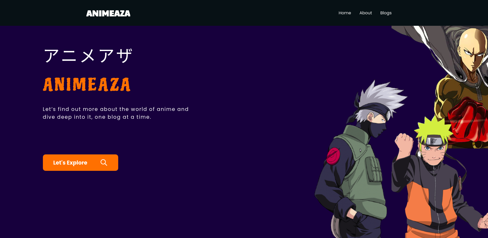
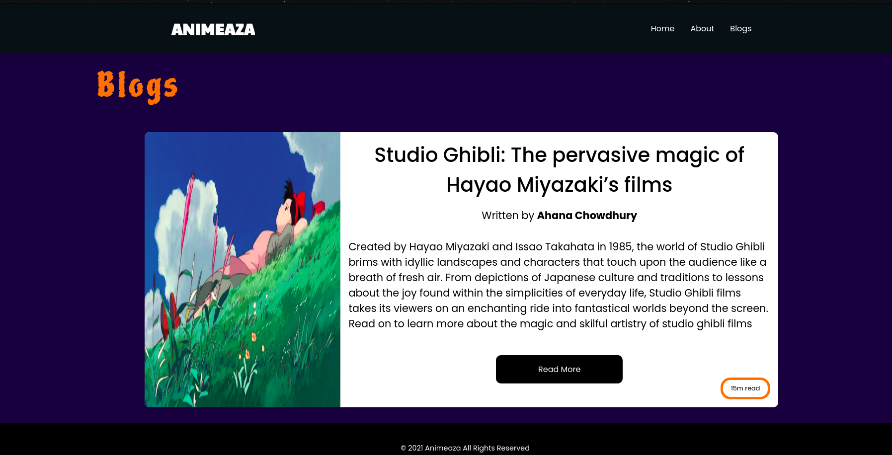
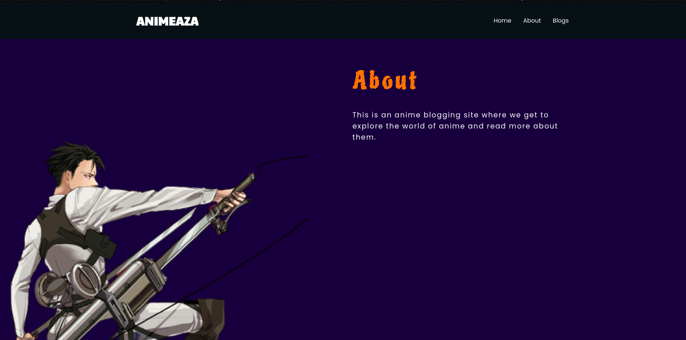

# Animeaza | The Anime Blog

If you're an anime fan, dive deeper into the world of anime, one blog at a time. This is an Anime blogging web application built using Next.js and Strapi Headless CMS.

The Strapi backend is hosted at https://strapi-animeaza.herokuapp.com/. Github Repo : https://github.com/pinkman7009/strapi-animeaza

## Built with

1. <a href='https://nextjs.org/'>next.js v10 with react v17</a>: Routing made much easier with Next.js and also image optimization provided by next/image.
2. <a href='https://strapi.io/'>Strapi Headless CMS</a>: Used for storing and adding blog articles with the Content type of blogs containing title,author,content,etc.
3. <a href='https://cloudinary.com/'>Cloudinary</a>: Used for storing and uploading images for the Strapi backend.
4. <a href='https://www.npmjs.com/package/react-spinners'>react-spinners</a>: For loading animations

## Screenshots

### Landing page

### Blogs page

### About page

## To Run

1. Clone into repo
2. Run `npm install`
3. Run `npm run dev`

## Live Demo

https://animeaza-blog-final.vercel.app/
